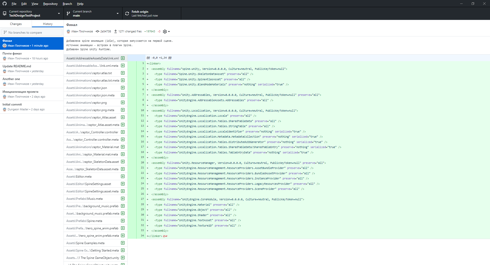
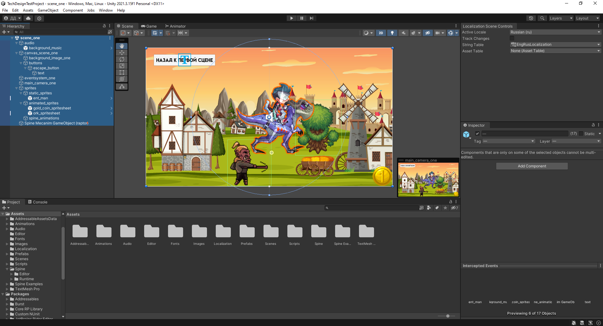
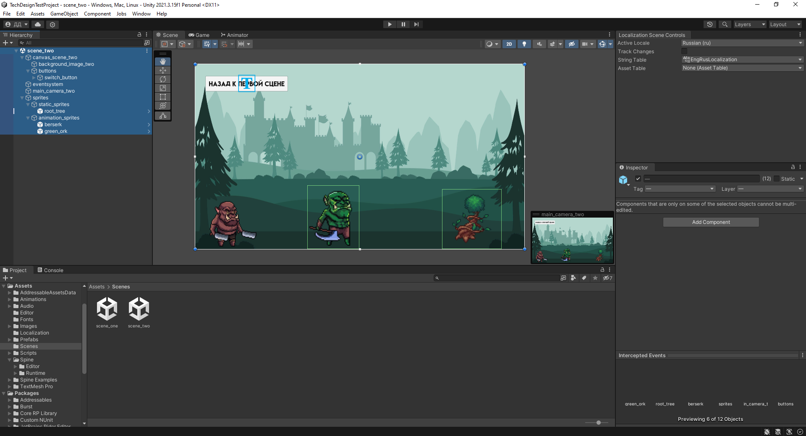

# TechDesignTestProject
Тестовое задание в Elephant Games

## Скриншот коммитов из гитклиента

## Источники взятых ассетов:
https://www.vecteezy.com/vector-art/6772887-medieval-town-scene-in-cartoon-style - бэк первой сцены  
https://www.vecteezy.com/vector-art/6928377-landscape-scene-silhouette-with-medieval-town - бэк второй сцены  
https://craftpix.net/freebies/free-game-coins-sprite-sheets/?num=1&count=8&sq=gold&pos=1 - золотые монеты (анимированный спрайт)  
https://craftpix.net/freebies/free-orc-sprite-sheets-pixel-art/ - орки (анимированные спрайты)  
https://craftpix.net/freebies/free-forest-objects-top-down-pixel-art/ - деревья (статичные спрайты)  
https://mixkit.co/free-sound-effects/ - SFX и фоновая музыка первой сцены  
https://russianfonts.org/fonts/lemonmilkrus-by-lyajka-regular - шрифт  

Все взятые ассеты защищены лицензиями либо для некоммерческого, либо для публичного использования

## Описание сцен:
Первая сцена - на canvas расположено фоновое изображение и скрытая в игровой сцене кнопка смены сцены.  
Дерево по центу справа - статичный спрайт с привязанным к нему BoxCollider2D и скриптом, который активирует UI кнопку смены сцены в левом верхнем углу.  
Монета в правом нижнем углу - анимированный спрайт.  
Орк по центру снизу - анимированный спрайт с привязанным к нему BoxCollider2D и скриптом, который активирует анимацию.  
Текст на кнопке в левом верхнем углу - локализуемая строка с переводом на русский и английский языки.  
Человек на динозавре по центру - Spine анимация, которая проигрывается по умолчанию при старте игры.  

Вторая сцена - на canvas расположено фоновое изображение и скрытая в игровой сцене кнопка смены сцены.  
Дерево в правом нижнем углу - статичный спрайт с привязанным к нему BoxCollider2D и скриптом, который активирует UI кнопку смены сцены в левом верхнем углу.  
Зеленый орк по центру - анимированный спракт с BoxCollider2D и скриптом, который активирует анимацию.  
Орк в левом углу - анимированный спрайт, который проигрывает анимацию при запуске сцены.  
Текст на кнопке в левом верхнем углу - локализуемая строка с переводом на русский и английский языки.  

## Ссылка на рабочий билд игры:
https://drive.google.com/drive/folders/1jUo2DSP539R--lZVnrt4M3lM2CqR_c_J?usp=share_link